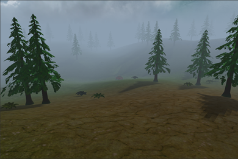

# Silent Forest

[TOC]

## 项目要求及实现

### 基本要求

- [x] 基于OpenGL/WebGL，具有基本体素（立方体、球、圆柱、圆锥、多面棱柱、多面棱台）的建模表达能力；
- [x] 具有基本三维网格导入导出功能（建议OBJ格式）；
- [x] 具有基本材质、纹理的显示和编辑能力；
- [x] 具有基本几何变换功能（旋转、平移、缩放等）；
- [x] 基本光照明模型要求，并实现基本的光源编辑（如调整光源的位置，光强等参数）；
- [x] 能对建模后场景进行漫游如Zoom In/Out， Pan, Orbit, Zoom To Fit等观察功能。

### 额外要求

- [x] 漫游时可实时碰撞检测

- [x] 光照明模型细化，实现实时阴影


## 游戏概览

### 游戏画面




### 游戏操作

* WS控制前后
* AD控制车头转动
* 鼠标左键控制视角
* 滚轮实现缩放


## 实现重点

### Obj导入与材质贴图导入


### 相机类与第三人称视角


### 地面纹理显示

使用BlendMap进行多纹理贴图显示，很好的进行了地面的显示，其中主要思路是根据一张有四种颜色的图片进行贴图绑定，不同的颜色区域绑定不同的纹理贴图，并且通过颜色的交织来实现多种纹理的混杂。具体实现的着色器代码如下：

```glsl
vec4 blendMapColor = texture(blendMap, pTexCoord);
float backTextureAmount = 1 - (blendMapColor.r + blendMapColor.g + blendMapColor.b);
vec2 tiledCoords = pTexCoord * 40.0;
vec4 backgroundTextureColor = texture(backgroundTexture, tiledCoords) * backTextureAmount;
vec4 rTextureColor = texture(rTexture, tiledCoords) * blendMapColor.r;
vec4 gTextureColor = texture(gTexture, tiledCoords) * blendMapColor.g;
vec4 bTextureColor = texture(bTexture, tiledCoords) * blendMapColor.b;

vec4 totalColor = backgroundTextureColor + rTextureColor + gTextureColor + bTextureColor;
```

可以看到，最终的纹理颜色将会是背景与三张贴图的混合。


### 地势构建


#### 高度变化

地形的基本贴图是一张平面，为了实现地形的起伏变化，我们采用了HeightMap设置地形高度。HeightMap是一张利用噪声生成的贴图，我们将其导入后根据纹理坐标读取对应位置的高度值，设置地形高度，从而将二维的地形拓展为三维地势。

```c++
// Terrain.h
unsigned char* data = stbi_load(heightMap.c_str(), &width, &height, &nrChannels, 0);
...
for (int i = 0; i < VERTEX_COUNT; i++) {
    for (int j = 0; j < VERTEX_COUNT; j++) {
        float tHeight = getHeight(j, i, height, width, data);
        vertices[vertexPointer * 3 + 1] = tHeight;
        ...
```


### 光源设计


#### 多光源

多光源的实现基于着色器的修改，允许传入`MAX_SIZE`的光源数，并在着色器中对所有光源逐一进行计算，得到最终的光照效果。光源的添加位于`CGProj.cpp`中，默认位置为(0,0,0)，默认白光。

```glsl
// Shader.fs
uniform vec3 lightPos[4];
...
for(int i=0; i<4; i++){
    toLightVector[i] = lightPos[i] - worldPos.xyz;
}
...
```


### 实时阴影

实时阴影的整体实现流程大致分为如下几步：创建帧缓冲，创建ShadowMap -> 建立光源视角，利用着色器生成阴影贴图 -> 利用阴影贴图计算遮挡关系，生成阴影。


#### 创建ShadowMap

我们在此处参考了[2]中的帧缓冲和shadowmap创建方式（虽然其他教程看了一下也都差不多），与原有帧缓冲和材质不同的是，ShadowMap禁止了Draw和Read功能，并将材质属性设置为深度测试。

```c++
glGenFramebuffers(1, &depthMapFBO);
// create depth texture
glGenTextures(1, &depthMap);
glBindTexture(GL_TEXTURE_2D, depthMap);
glTexImage2D(GL_TEXTURE_2D, 0, GL_DEPTH_COMPONENT, SHADOW_WIDTH, SHADOW_HEIGHT, 0, GL_DEPTH_COMPONENT, GL_FLOAT, NULL);
glTexParameteri(GL_TEXTURE_2D, GL_TEXTURE_MIN_FILTER, GL_NEAREST);
glTexParameteri(GL_TEXTURE_2D, GL_TEXTURE_MAG_FILTER, GL_NEAREST);
glTexParameteri(GL_TEXTURE_2D, GL_TEXTURE_WRAP_S, GL_CLAMP_TO_EDGE);
glTexParameteri(GL_TEXTURE_2D, GL_TEXTURE_WRAP_T, GL_CLAMP_TO_EDGE);

// attach depth texture as FBO's depth buffer
glBindFramebuffer(GL_FRAMEBUFFER, depthMapFBO);
glFramebufferTexture2D(GL_FRAMEBUFFER, GL_DEPTH_ATTACHMENT, GL_TEXTURE_2D, depthMap, 0);
glDrawBuffer(GL_NONE);
glReadBuffer(GL_NONE);
```

#### 建立光源视角，生成ShadowMap

由于找到的教程中框架与我们的工程框架不相符，后面的相关代码都是我们自行构建的。主要涉及`ShadowEntityRender.h`和`ShadowShader.h`两个类，前者负责调用ShadowShader实现物体在ShadowMap上的渲染，后者负责通过`depth.fs`和`depth.vs`两个glsl文件生成专用的阴影着色器。ShadowEntityRender的渲染操作在`MasterRender.h`的`ShadowRender()`函数中执行。

#### 利用阴影贴图计算遮挡关系，生成阴影

利用ShadowMap生成最后阴影的过程主要在Terrain相关类中实现。

- 向TerrainShader中导入ShadowMap
- 利用ShadowMap计算遮挡关系，实现阴影效果，同时利用PCF进行阴影优化

```c++
// TShader.fs
float ShadowCalculation(vec4 fragPosLightSpace)
{
    // perform perspective divide
    vec3 shadowCoords = fragPosLightSpace.xyz / fragPosLightSpace.w;
    // transform to [0,1] range
    shadowCoords = shadowCoords * 0.5 + 0.5;
    // get closest depth value from light's perspective 
    float closestDepth = texture(shadowMap, shadowCoords.xy).r; 
    // get depth of current fragment from light's perspective
    float currentDepth = shadowCoords.z;
    // check whether current frag pos is in shadow
    float bias = 0.001;
	//float shadow = currentDepth - bias > closestDepth  ? 0.7 : 1.0; 
	float shadow = 0.0;
	vec2 texelSize = 1.0 / textureSize(shadowMap, 0);
	for(int x = -1; x <= 1; ++x){
		for(int y = -1; y <= 1; ++y){
			float pcfDepth = texture(shadowMap, shadowCoords.xy + vec2(x, y) * texelSize).r; 
			shadow += currentDepth - bias > pcfDepth ? 0.6 : 0.0;        
		}    
	}
	shadow /= 9.0;
	// keep the shadow at 0.0 when outside the far_plane region of the light's frustum.
	if(shadowCoords.z > 1.0)
        shadow = 0.0;
    return shadow;
}
```


### 雾效与SkyBox

#### 雾效的实现


#### SkyBox的实现

SkyBox我们使用简单的立方体贴图，将整个场景覆盖起来，并且始终保证摄像机处在SkyBox的中间，读取SkyBox的六张贴图就利用在贴图导入部分所描述的loadTexture函数，这里主要展示它的着色器代码

```glsl
#version 400 core

in vec3 textureCoord;
out vec4 FragColor;

uniform samplerCube cubeMap;
uniform vec3 fogColor;

const float lowerLimit = 0.0;
const float upperLimit = 60.0;

void main(void) {
    vec4 FinalColor = texture(cubeMap, textureCoord);

    float factor = (textureCoord.y - lowerLimit) / (upperLimit - lowerLimit);
    factor = clamp(factor, 0.0, 1.0);
    FragColor = mix(vec4(fogColor, 1.0), FinalColor, factor);
}
```

```glsl
#version 400 core

layout (location = 0) in vec3 position;
out vec3 textureCoord;

uniform mat4 projectionMatrix;
uniform mat4 viewMatrix;

void main()
{
    textureCoord = position;
    vec4 pos = projectionMatrix * viewMatrix * vec4(position, 1.0);
    gl_Position = pos.xyww;
}
```

在这里我组与普通天空盒稍有区别，为了使得天空盒与雾效比较配合，我组在绘制颜色时将天空颜色与雾的颜色同时考虑：越是靠近地面的物体，雾越浓（也就是越能表现出雾的颜色），往高处，才会慢慢凸物体，最上层（超过某个高度）则是物体本身的颜色或者天空盒子的颜色。原理如下图所示：(图片来源：https://codeantenna.com/a/8JOrZV9ExO)


最终我们可以得到一个比较好的效果


## 运行方法与环境


## 小组成员

* 曾帅 3190105729
* 王异鸣
* 杨淇森 3190105500


## 参考资料

### 工程实现参考

1. glfw基本框架与opengl基础功能(shader/render)参考：https://learnopengl-cn.github.io/01%20Getting%20started/04%20Hello%20Triangle/
2. 实时阴影：[LearnOpenGL - Shadow Mapping](https://learnopengl.com/Advanced-Lighting/Shadows/Shadow-Mapping)
3. 地面纹理与BlendMap：https://www.chinedufn.com/webgl-multitexture-blend-map-tutorial/
4. SkyBox雾效问题解决：https://codeantenna.com/a/8JOrZV9ExO
5. 地形绘制与基本雾：https://lwjglbook-cn-translation.readthedocs.io/zh_CN/latest/


### 项目资源来源

* http://free3d.com/