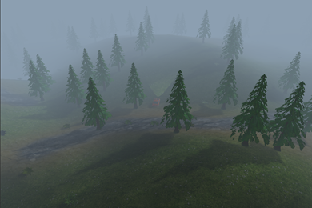
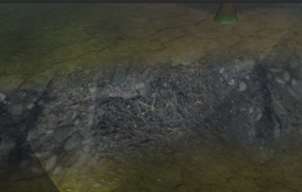
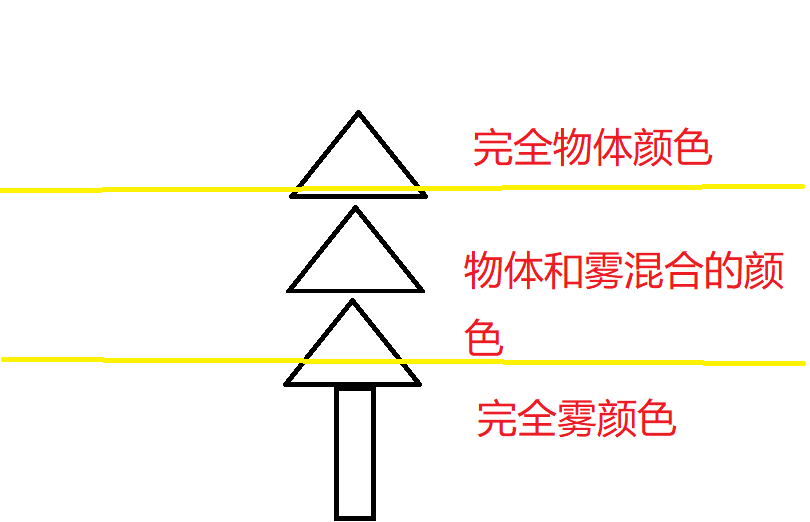
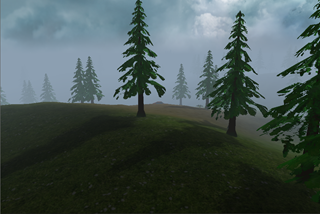

# Silent Forest

[TOC]

## 项目要求及实现

### 基本要求

- [x] 基于OpenGL/WebGL，具有基本体素（立方体、球、圆柱、圆锥、多面棱柱、多面棱台）的建模表达能力；
- [x] 具有基本三维网格导入导出功能（建议OBJ格式）；
- [x] 具有基本材质、纹理的显示和编辑能力；
- [x] 具有基本几何变换功能（旋转、平移、缩放等）；
- [x] 基本光照明模型要求，并实现基本的光源编辑（如调整光源的位置，光强等参数）；
- [x] 能对建模后场景进行漫游如Zoom In/Out， Pan, Orbit, Zoom To Fit等观察功能。

### 额外要求

- [x] 漫游时可实时碰撞检测

- [x] 光照明模型细化，实现实时阴影


## 游戏概览

### 游戏画面




### 游戏操作

* WS控制前后
* AD控制车头转动
* 鼠标左键控制视角
* 滚轮实现缩放


## 实现重点

### Obj导入与材质贴图导入


### 相机类与第三人称视角


### 地面纹理显示

使用BlendMap进行多纹理贴图显示，很好的进行了地面的显示，其中主要思路是根据一张有四种颜色的图片进行贴图绑定，不同的颜色区域绑定不同的纹理贴图，并且通过颜色的交织来实现多种纹理的混杂。具体实现的着色器代码如下：

```glsl
vec4 blendMapColor = texture(blendMap, pTexCoord);
float backTextureAmount = 1 - (blendMapColor.r + blendMapColor.g + blendMapColor.b);
vec2 tiledCoords = pTexCoord * 40.0;
vec4 backgroundTextureColor = texture(backgroundTexture, tiledCoords) * backTextureAmount;
vec4 rTextureColor = texture(rTexture, tiledCoords) * blendMapColor.r;
vec4 gTextureColor = texture(gTexture, tiledCoords) * blendMapColor.g;
vec4 bTextureColor = texture(bTexture, tiledCoords) * blendMapColor.b;

vec4 totalColor = backgroundTextureColor + rTextureColor + gTextureColor + bTextureColor;
```

可以看到，最终的纹理颜色将会是背景与三张贴图的混合。



### 地势构建


### 光源设计


### 实时阴影


### 雾效与SkyBox

#### 雾效的实现


#### SkyBox的实现

SkyBox我们使用简单的立方体贴图，将整个场景覆盖起来，并且始终保证摄像机处在SkyBox的中间，读取SkyBox的六张贴图就利用在贴图导入部分所描述的loadTexture函数，这里主要展示它的着色器代码

```glsl
#version 400 core

in vec3 textureCoord;
out vec4 FragColor;

uniform samplerCube cubeMap;
uniform vec3 fogColor;

const float lowerLimit = 0.0;
const float upperLimit = 60.0;

void main(void) {
    vec4 FinalColor = texture(cubeMap, textureCoord);

    float factor = (textureCoord.y - lowerLimit) / (upperLimit - lowerLimit);
    factor = clamp(factor, 0.0, 1.0);
    FragColor = mix(vec4(fogColor, 1.0), FinalColor, factor);
}
```

```glsl
#version 400 core

layout (location = 0) in vec3 position;
out vec3 textureCoord;

uniform mat4 projectionMatrix;
uniform mat4 viewMatrix;

void main()
{
    textureCoord = position;
    vec4 pos = projectionMatrix * viewMatrix * vec4(position, 1.0);
    gl_Position = pos.xyww;
}
```

在这里我组与普通天空盒稍有区别，为了使得天空盒与雾效比较配合，我组在绘制颜色时将天空颜色与雾的颜色同时考虑：越是靠近地面的物体，雾越浓（也就是越能表现出雾的颜色），往高处，才会慢慢凸物体，最上层（超过某个高度）则是物体本身的颜色或者天空盒子的颜色。原理如下图所示：(图片来源：https://codeantenna.com/a/8JOrZV9ExO)



最终我们可以得到一个比较好的效果




## 运行方法与环境


## 小组成员

* 曾帅 3190105729
* 王异鸣
* 杨淇森


## 参考资料

### 工程实现参考

* glfw基本框架与opengl基础功能(shader/render)参考：https://learnopengl-cn.github.io/01%20Getting%20started/04%20Hello%20Triangle/
* 地面纹理与BlendMap：https://www.chinedufn.com/webgl-multitexture-blend-map-tutorial/
* SkyBox雾效问题解决：https://codeantenna.com/a/8JOrZV9ExO


### 项目资源来源

* http://free3d.com/